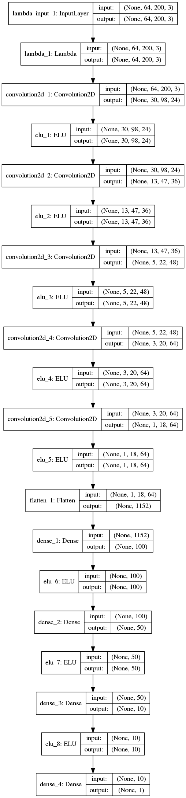
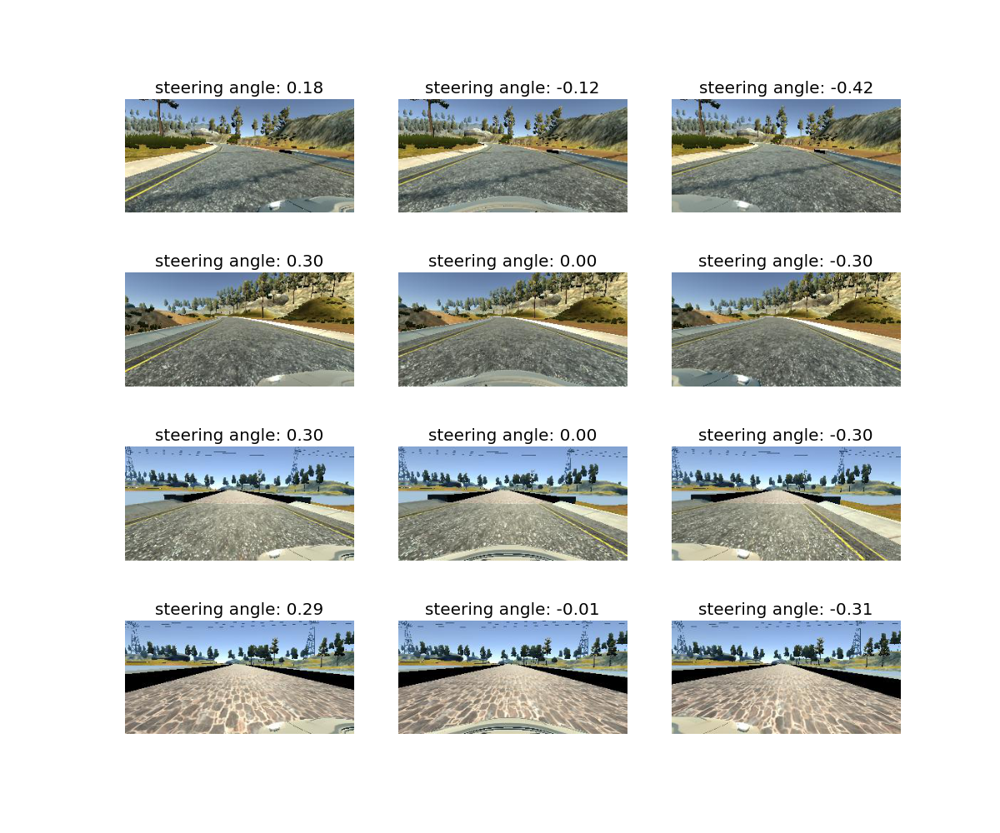
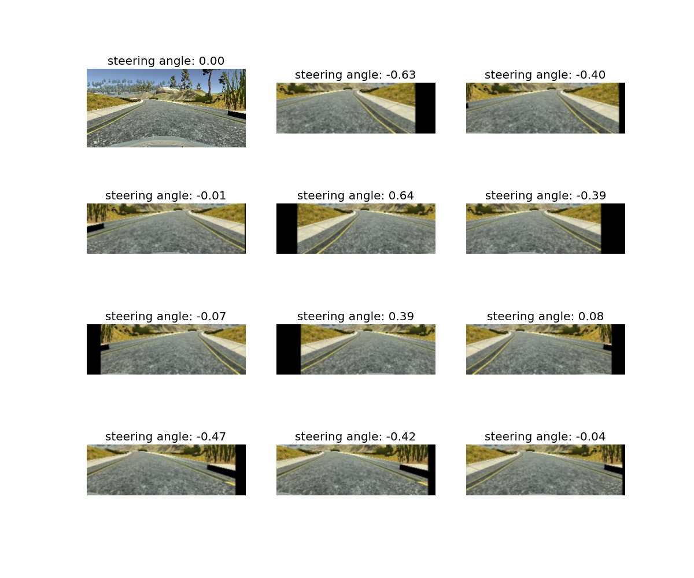

#**Behavioral Cloning** 

---

**Behavrioal Cloning Project**

The goal of this project is to implement a behavioral cloning agent
that autonomously drives a car in driving simulator. It comprises of
the following steps:
* Use the simulator to collect samples of good driving behavior
* Build, a convolution neural network in Keras that predicts steering
   angles from images
* Train and validate the model with a training and validation set
* Test that the model successfully drives around track one
  without leaving the road
* Summarize the results with a written report


[//]: # (Image References)

[image1]: ./examples/placeholder.png "Model Visualization"
[image2]: ./examples/placeholder.png "Grayscaling"
[image3]: ./examples/placeholder_small.png "Recovery Image"
[image4]: ./examples/placeholder_small.png "Recovery Image"
[image5]: ./examples/placeholder_small.png "Recovery Image"
[image6]: ./examples/placeholder_small.png "Normal Image"
[image7]: ./examples/placeholder_small.png "Flipped Image"

## Rubric Points
Here I will consider the
[rubric points](https://review.udacity.com/#!/rubrics/432/view)
individually and describe how I addressed each point in my implementation.  

---
###Files Submitted & Code Quality

####1. Submission includes all required files and can be used to run the simulator in autonomous mode

My project includes the following files:
* model.py containing the script to create and train the model
* drive.py for driving the car in autonomous mode
* model.json containing keras dump of used architecture 
* model.h5 containing weights of the trained neural network
* writeup.md

####2. Submssion includes functional code
Using the Udacity provided simulator and my drive.py file, the car can be driven autonomously
around the track by executing 
```sh
python drive.py model.json
```

####3. Submssion code is usable and readable

The model.py file contains the code for training and saving the convolution
neural network.  The file shows the pipeline I used for training and validating
the model, and it contains comments to explain how the code works.

###Model Architecture and Training Strategy

####1. An appropriate model arcthiecture has been employed

My model follows an architecture that is essentially a slightly simplified
version of architecture presented in NVIDIA's
[End to End Learning for Self-Driving Cars](https://images.nvidia.com/content/tegra/automotive/images/2016/solutions/pdf/end-to-end-dl-using-px.pdf).

    
    
The final used architecture can be seen on the below picture:



The model has:

* input centering layer, that changes the range of data to `[-1.0, 1.0]`.
* 5 convolutional layers, with increasing number of feature maps 
   `3 -> 24 -> 36 -> 48 -> 64 -> 64` and aggresive (halving) subsampling in
   the first three layers. Convolutional layers are followed by ELU nonlinearities.
* 4 dense layers with `100, 50, 10` and `1` neurons, each followed by ELU
  non-linearity.


####2. Attempts to reduce overfitting in the model

The model was trained and validated on different data sets to ensure that the model
was not overfitting.

The model was tested by running it through the simulator and ensuring that the vehicle 
could stay on the track.

####3. Model parameter tuning

The model used an Adam optimizer, so the learning rate was not tuned manually.

####4. Training data gathering and augmentation


I have experimented a lot with different augmentation options:
* Brightness augmentation 
* Applying darker and lighter patches to the input image
* random translations with corresponding steering rate augmentation
* random flips
* smoothing the steering angle in time
* cropping out parts of image that do not change
* using the left and right camera images
* gathering data at 50 Hz


I have tried some additional data gathering tricks:
* driving the car other way around the track
* gathering 'recoveries' - steering the car to the side and back to the center
  again
* using analog gaming pad input instead of keyboard input in order to smooth 
  the steering rate
  
  
I have observed the following:
1) If I use all of the above augmentation, the performance is more general. The
 car is able to drive other way around the track and on the other, darker
track. However, it is less stable with respect to unknown states on the easier,
lighter track. It is a pretty surprising 'contradiction'.
   
2) If i leave only some of the above tricks on and gather significant amount of
   data for the first track, I am able to fit the first track (perhaps overfit in
   the light of the above remark) and produce a pretty stable model.
   
Therefore in the final submission I have used 25 minutes of data gathered with
the random translations, smoothing the steering angle, random flips cropping,
left and right images, data at 50 Hz, using analog gaming pad.

This has enabled me to produce a model about which I am sure on the first
track, at a cost of poor performance on the second track.

Let me visualize some of the data processing steps.

The following graph shows four example images from the training dataset.  Each
row shows images from left, center and right cameras.  We can see the the
bonnet is in the picture. It does not ever change (maybe only it's lighting
changes sometimes) and provides almost no additional information, so we can
crop it out of the picture.



A sample of different processed versions of one training image are shown on
the below picture.




###Model Architecture and Training Strategy

####1. Solution Design Approach

The overall strategy was to implement a variation of NVIDIA's paper
* [End to End Learning for Self-Driving Cars](https://images.nvidia.com/content/tegra/automotive/images/2016/solutions/pdf/end-to-end-dl-using-px.pdf).
I have decided to use this model because it works, as seen in the paper, and it
is simple enough to enable a lot of quick experimentation.

I started out by implementing the model and testing that it works on only 10
`(image, steering)` pairs from the Udacity-supplied dataset. It is a nice
sanity check that makes it easy to spot an early mistake in the model. I have
gathered my own dataset, driving for 3 laps using keyboard and saving pictures
at 10 Hz.

I have then split the produced training dataset into 10% validation and 90%
training set and started training. Model's performance on training set 
has translated well in performance on the validation set. It was not
surprising for me, as I knew the model was working well for the others,
however it was still intersting to see that it does not overfit 
even without using Dropout / Regularization and other similar methods.

The neural network performed well, which does not mean that the driving agent
was performing well. The car was driving in a wobbly way, leaning to easily
from left to right. To combat this problem I have implemented several measures:
* I have driven the car using analog stick of the Xbox gamepad 
* I have gathered data at 50 hz
* I have smoothed the driving angle as a function of time using EWMA
* I have excluded data where the speed is lower than 15
* I have gathered significantly longer driving history

This made the drive a lot smoother.

To combat overfitting to the first track, I have tried out a big variety of 
augmentation and data gathering tricks, that I have described above.

They have increased the driving performance on the second track, but 
decreased the performance on the first track. Perhaps some tuning of
the learning hyperparams was needed to fully explore this.
However in the end I have decided to skip most of the augmentation and
gather bigger amounts of data on the first track.
Therefore in the final submission I have used 25 minutes of data gathered with
the random translations, smoothing the steering angle, random flips cropping,
left and right images, data at 50 Hz, using analog gaming pad.

Each time I was changing something, I tried to test several networks with 
different random seeds in the simulator.

####2. Acknowledgements, sources.

The general idea of using ConvNets with pictures from 3 cameras (right, left
center) is popular. While I was implementing this project, I came across
this idea in three separate sources, most of which were cross-referencing
each other.

These sources were:

* [UC Berkeley Deep reinforcement learning course](http://rll.berkeley.edu/deeprlcourse/)
* A paper by comma.ai: [Learning a Driving Simulator](https://arxiv.org/abs/1608.01230).
  Code for this paper can be found on [company's GitHub account](https://github.com/commaai/research).
* [End to End Learning for Self-Driving Cars](https://images.nvidia.com/content/tegra/automotive/images/2016/solutions/pdf/end-to-end-dl-using-px.pdf)


Additionally, I have seen 
* Udacity Atlassian forums
* A post by Vivek Yadav, describing his experiences with this project
[An augmentation based deep neural network approach to learn human driving behavior](https://chatbotslife.com/using-augmentation-to-mimic-human-driving-496b569760a9#.5zyhj4mam)
