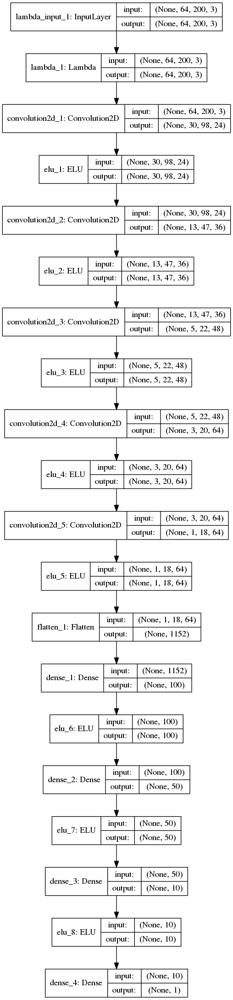

#**Behavioral Cloning** 

##Writeup Template

---

**Behavrioal Cloning Project**

The goals / steps of this project are the following:
* Use the simulator to collect data of good driving behavior
* Build, a convolution neural network in Keras that predicts steering angles from images
* Train and validate the model with a training and validation set
* Test that the model successfully drives around track one without leaving the road
* Summarize the results with a written report


[//]: # (Image References)

[image1]: ./examples/placeholder.png "Model Visualization"
[image2]: ./examples/placeholder.png "Grayscaling"
[image3]: ./examples/placeholder_small.png "Recovery Image"
[image4]: ./examples/placeholder_small.png "Recovery Image"
[image5]: ./examples/placeholder_small.png "Recovery Image"
[image6]: ./examples/placeholder_small.png "Normal Image"
[image7]: ./examples/placeholder_small.png "Flipped Image"

## Rubric Points
Here I will consider the [rubric points](https://review.udacity.com/#!/rubrics/432/view)
individually and describe how I addressed each point in my implementation.  

---
###Files Submitted & Code Quality

####1. Submission includes all required files and can be used to run the simulator in autonomous mode

My project includes the following files:
* model.py containing the script to create and train the model
* drive.py for driving the car in autonomous mode
* model.json containing keras dump of used architecture 
* model.h5 containing weights of the trained neural network
* writeup.md

####2. Submssion includes functional code
Using the Udacity provided simulator and my drive.py file, the car can be driven autonomously
around the track by executing 
```sh
python drive.py model.json
```

####3. Submssion code is usable and readable

The model.py file contains the code for training and saving the convolution neural network.
 The file shows the pipeline I used for training and validating the model, and it contains comments to explain how the code works.

###Model Architecture and Training Strategy

####1. An appropriate model arcthiecture has been employed

My model follows an architecture that is essentially a slightly simplified version of
architecture presented in NVIDIA's
[End to End Learning for Self-Driving Cars](https://images.nvidia.com/content/tegra/automotive/images/2016/solutions/pdf/end-to-end-dl-using-px.pdf).

It is a standard architecture, mimicked and modified in other papers concerning self-driving cars,
such as Comma.ai [Learning a Driving Simulator](https://arxiv.org/abs/1608.01230), for which
code can be seen on [company's GitHub account](https://github.com/commaai/research).
    
    
The final used architecture can be seen on the below picture:




The model has:

* input centering layer, that changes the range of data to `[-1.0, 1.0]`.
* 5 convolutional layers, with increasing number of feature maps 
   `3 -> 24 -> 36 -> 48 -> 64 -> 64` and aggresive (halving) subsampling in
   the first three layers. Convolutional layers are followed by ELU nonlinearities.
* 4 dense layers with `100, 50, 10` and `1` neurons, each followed by ELU
  non-linearity.


####2. Attempts to reduce overfitting in the model

The model was trained and validated on different data sets to ensure that the model
was not overfitting.

The model was tested by running it through the simulator and ensuring that the vehicle 
could stay on the track.

####3. Model parameter tuning

The model used an Adam optimizer, so the learning rate was not tuned manually.

####4. Training data gathering and augmentation


I have experimented a lot with different augmentation options:
* Brightness augmentation 
* Applying darker and lighter patches to the input image
* random translations with corresponding steering rate augmentation
* random flips
* smoothing the steering angle in time
* cropping out parts of image that do not change
* using the left and right camera images
* gathering data at 50 Hz


I have tried some additional data gathering tricks:
* driving the car other way around the track
* gathering 'recoveries' - steering the car to the side and back to the center
  again
* using analog gaming pad input instead of keyboard input in order to smooth 
  the steering rate
  
  
I have observed the following:
1) If I use all of above augmentation, the performance is more general (the car
   is able to drive other way around the track and on the other, darker track),
   however it is less stable with respect to unknown states on the easier, lighter 
   track. It is a pretty surprising 'contradiction'.
   
2) If i leave only some of the above tricks on and gather significant amount
   of data for the first track, I am able to fit (perhaps overfit in the light
   of the above remark) and produce a pretty stable model.
   
Therefore in the final submission I use 25 minutes of data gathered with the 
random translations, smoothing the steering angle,
random flips cropping, left and right images,
data at 50 Hz, using analog gaming pad.

This enables me to produce a model about which I am sure on the first track, at
a cost of poor performance on the second track.


###Model Architecture and Training Strategy

####1. Solution Design Approach

The overall strategy for deriving a model architecture was to ...

My first step was to use a convolution neural network model similar to the ... I thought this model might be appropriate because ...

In order to gauge how well the model was working, I split my image and steering angle data into a training and validation set. I found that my first model had a low mean squared error on the training set but a high mean squared error on the validation set. This implied that the model was overfitting. 

To combat the overfitting, I modified the model so that ...

Then I ... 

The final step was to run the simulator to see how well the car was driving around track one. There were a few spots where the vehicle fell off the track... to improve the driving behavior in these cases, I ....

At the end of the process, the vehicle is able to drive autonomously around the track without leaving the road.

####2. Final Model Architecture

The final model architecture (model.py lines 18-24) consisted of a convolution neural network with the following layers and layer sizes ...

Here is a visualization of the architecture (note: visualizing the architecture is optional according to the project rubric)

To capture good driving behavior, I first recorded two laps on track one using center lane driving. Here is an example image of center lane driving:

I then recorded the vehicle recovering from the left side and right sides of the road back to center so that the vehicle would learn to .... These images show what a recovery looks like starting from ... :

Then I repeated this process on track two in order to get more data points.

To augment the data sat, I also flipped images and angles thinking that this would ... For example, here is an image that has then been flipped:

After the collection process, I had X number of data points. I then preprocessed this data by ...


I finally randomly shuffled the data set and put Y% of the data into a validation set. 

I used this training data for training the model. The validation set helped determine if the model was over or under fitting. The ideal number of epochs was Z as evidenced by ... I used an adam optimizer so that manually training the learning rate wasn't necessary.
